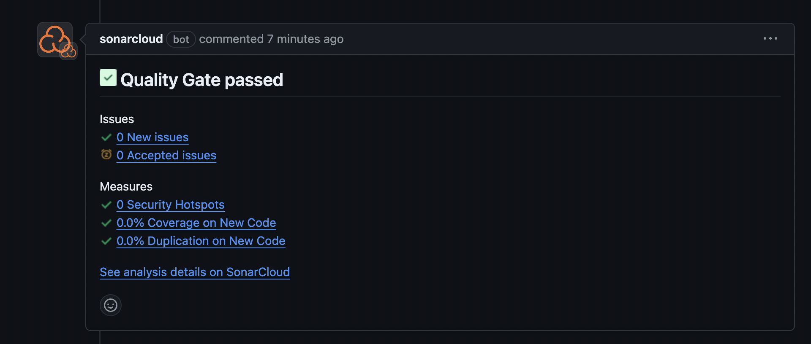

# CI Pipeline for .NET 5 Application with Trivy Vulnerability Scanning and SonarCloud Integration

## Overview

This guide details the process of setting up a CI/CD pipeline for a .NET 5 application using GitHub Actions. The pipeline covers building and pushing a Docker image, conducting vulnerability scans with Trivy, performing code quality and security checks using SonarCloud, and executing integration tests on the Docker image.

## Prerequisites

- **GitHub Repository**: Have a GitHub repository containing your .NET 5 application.
- **DockerHub Account**: Register for a DockerHub account and obtain an access token.
- **SonarCloud Account**: Sign up for a SonarCloud account, create a project, and generate an access token.
- **Trivy**: Trivy is a free, open-source vulnerability scanner designed for containers and other artifacts.
- **GitHub Secrets**: Ensure the following secrets are added to your GitHub repository:
  - `DOCKERHUB_USERNAME`: Your DockerHub username.
  - `DOCKERHUB_TOKEN`: Your DockerHub access token.
  - `SONAR_TOKEN`: Your SonarCloud access token.

## Directory Structure

Repository directory structure:

```plaintext
.
├── src
│   ├── DevOpsChallenge.SalesApi
│   │   ├── appsettings.Development.json
│   │   └── ... (other source files)
│   └── ... (other folders)
├── tests
│   ├── DevOpsChallenge.SalesApi.Business.UnitTests
│   │   ├── DevOpsChallenge.SalesApi.Business.UnitTests.csproj
│   │   └── ... (test files)
│   └── ... (other folders)
├── Dockerfile
├── README.md
└── .github
    └── workflows
        └── CI-dev.yaml
```

## GitHub Actions Workflow

Create a GitHub Actions workflow file (`.github/workflows/CI-dev.yaml`) with the following content:

### YAML Configuration

Below is the configuration used for the GitHub Actions CI pipeline:

```yaml
name: CI Pipeline
on:
  push:
    branches:
      - main
  pull_request:
    types: [opened, synchronize, reopened]

jobs:
  sonar-scan:
    name: Sonar Scan And Analyze
    runs-on: ubuntu-latest
    steps:
      - name: Set up JDK 17
        uses: actions/setup-java@v3
        with:
          java-version: 17
          distribution: 'zulu'
          
      - uses: actions/checkout@v3
        with:
          fetch-depth: 0

      - name: Cache SonarCloud packages
        uses: actions/cache@v3
        with:
          path: ~/.sonar/cache
          key: ${{ runner.os }}-sonar
          restore-keys: ${{ runner.os }}-sonar

      - name: Cache SonarCloud scanner
        id: cache-sonar-scanner
        uses: actions/cache@v3
        with:
          path: .sonar/scanner
          key: ${{ runner.os }}-sonar-scanner
          restore-keys: ${{ runner.os }}-sonar-scanner

      - name: Install SonarCloud scanner
        if: steps.cache-sonar-scanner.outputs.cache-hit != 'true'
        run: |
          mkdir -p .sonar/scanner
          dotnet tool update dotnet-sonarscanner --tool-path .sonar/scanner

      - name: Build and analyze
        env:
          # GITHUB_TOKEN: ${{ secrets.GITHUB_TOKEN }}
          SONAR_TOKEN: ${{ secrets.SONAR_TOKEN }}
        run: |
          ./.sonar/scanner/dotnet-sonarscanner begin /k:"Pasan-Wijerathne_swivel-devops-challenge" /o:"pasan-wijerathne" /d:sonar.token="${{ secrets.SONAR_TOKEN }}" /d:sonar.host.url="https://sonarcloud.io"
          dotnet build
          ./.sonar/scanner/dotnet-sonarscanner end /d:sonar.token="${{ secrets.SONAR_TOKEN }}"

  docker-image-scan:
    name: Docker Image Scan
    runs-on: ubuntu-20.04
    needs: sonar-scan
    steps:
      - name: Checkout code
        uses: actions/checkout@v2

      - name: Build an image from Dockerfile
        run: |
          docker build -t docker.io/pasanpw/swivel-devops-challenge:${{ github.sha }} .

      - name: Run Trivy vulnerability scanner
        uses: aquasecurity/trivy-action@0.20.0
        with:
          image-ref: 'docker.io/pasanpw/swivel-devops-challenge:${{ github.sha }}'
          format: 'table'
          exit-code: '0'
          ignore-unfixed: true
          vuln-type: 'os,library'
          severity: 'UNKNOWN,LOW,MEDIUM,CRITICAL,HIGH'
          output: trivy-report.json

      - name: Display Trivy scan results
        if: always()
        run: |
          echo "## Trivy Vulnerability Scan Results" >> $GITHUB_STEP_SUMMARY
          cat trivy-report.json >> $GITHUB_STEP_SUMMARY

      - name: Upload Trivy report artifact
        if: always()
        uses: actions/upload-artifact@v3
        with:
          name: trivy-report
          path: trivy-report.json

  docker-build-push:
    name: Docker Build and Push
    runs-on: ubuntu-latest
    needs: [sonar-scan, docker-image-scan]
    steps:
      - name: Checkout
        uses: actions/checkout@v4

      - name: Set up QEMU
        uses: docker/setup-qemu-action@v3

      - name: Set up Docker Buildx
        uses: docker/setup-buildx-action@v3

      - name: Login to Docker Hub
        uses: docker/login-action@v3
        with:
          username: ${{ secrets.DOCKERHUB_USERNAME }}
          password: ${{ secrets.DOCKERHUB_TOKEN }}

      - name: Build and push
        uses: docker/build-push-action@v6
        with:
          context: .
          push: true
          tags: pasanpw/swivel-devops-challenge:${{ github.sha }}
```

## Workflow Steps Explanation :

### Sonar Scan And Analyze Job:

- **Set up JDK 17 :** Configures the Java Development Kit (JDK) 17, which is required by SonarCloud for analysis.
- **Checkout :** Checks out the repository to make the code available for SonarCloud analysis.
- **Cache SonarCloud packages :** Caches SonarCloud packages to speed up the analysis by avoiding repeated downloads.
- **Cache SonarCloud scanner :** Caches the SonarCloud scanner to speed up the setup process by avoiding repeated installations.
- **Install SonarCloud scanner :** Installs the SonarCloud scanner tool if it’s not already cached. This tool is necessary for running the SonarCloud analysis.
- **Build and analyze :** Runs the SonarCloud analysis on the .NET project. This involves starting the scanner, building the project, and then ending the scan to upload the results to SonarCloud.

### Docker Image Scan Job:

- **Checkout code :** Checks out the repository to access the Dockerfile and the code for building the Docker image.
- **Build an image from Dockerfile :** Builds a Docker image using the Dockerfile located in the repository.
- **Run Trivy vulnerability scanner :** Uses Trivy to scan the Docker image for vulnerabilities. The results are outputted in a JSON format.
- **Display Trivy scan results :** Outputs the results of the Trivy scan to the GitHub Actions summary for visibility.
- **Upload Trivy report artifact :** Uploads the Trivy scan results as an artifact, which can be downloaded and reviewed later.

### Docker Build and Push Job:

- **Checkout :** Checks out the repository to access the Dockerfile and source code for building the Docker image.
- **Set up QEMU :** Configures QEMU for cross-platform builds, allowing Docker images to be built for different architectures.
- **Set up Docker Buildx :** Sets up Docker Buildx, which enables advanced Docker build features like multi-platform builds.
- **Login to Docker Hub :** Authenticates with Docker Hub using the provided credentials, allowing Docker images to be pushed to the Docker Hub registry.
- **Build and push :** Builds the Docker image and pushes it to Docker Hub, tagging it with the current commit SHA for versioning.

## Best Practices

**Modular Jobs:** Each workflow job is designed to handle a specific task, which makes the overall workflow more modular and easier to manage.

**Secrets Management:** Sensitive credentials, including DockerHub and SonarCloud tokens, are securely stored and managed using GitHub Secrets.

**Caching:** Implementing caching in the workflow reduces time spent on repetitive downloads and installations, thereby improving efficiency.

**Dependency Management:** Proper management of dependencies ensures consistent and reliable builds across different runs of the workflow.

**Vulnerability Scanning:** Trivy is employed to scan both the Docker image and codebase for vulnerabilities, allowing early detection of potential security issues.

**Code Quality Analysis:** SonarCloud performs code quality and security checks to ensure adherence to best practices and coding standards.


## Screenshots



## Conclusion

This guide outlines how to establish a CI/CD pipeline for a .NET 5 application using GitHub Actions. It covers the process of building and pushing Docker images, scanning for vulnerabilities with Trivy, analyzing code quality with SonarCloud, and running integration tests. Adhering to these practices will help ensure high-quality deliverables and an efficient development process.